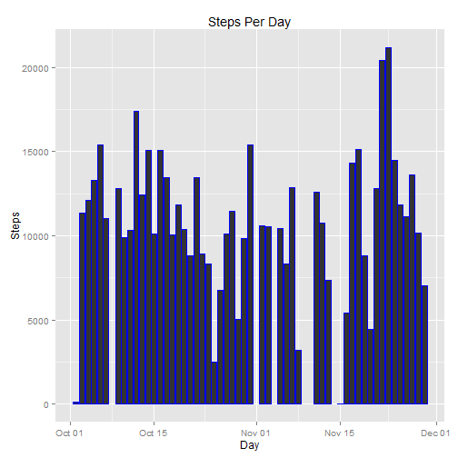
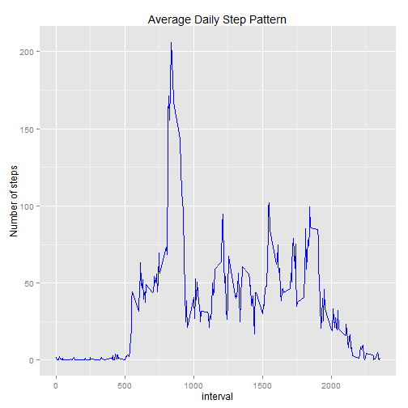
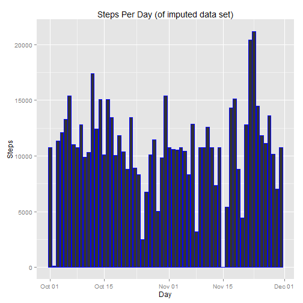
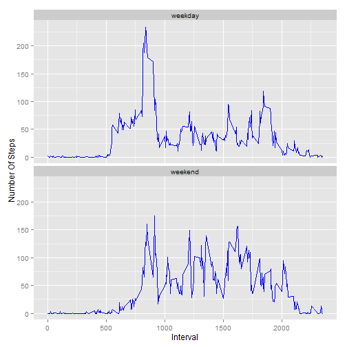

###Load the library's used
I will be suppressing the messages generated during load. I have reviewed these messages and they provide no value. You may want to remove the message suppression when running on your system.

```r
suppressWarnings(suppressMessages(library(dplyr)))
suppressWarnings(suppressMessages(library(ggplot2)))
```

## Loading and preprocessing the data
The data will be read directly from the zip file. There is no need to unzip the csv first. THe activity.zip file should be located in the working directory.


```r
activity <- read.table(unz("activity.zip","activity.csv"),
                       header = T,quote="\"", sep=",",na.strings = NA)
```

We change the column types for usibility

```r
activity$date     <- as.Date(activity$date, format = "%Y-%m-%d ")
activity$interval <- as.integer(activity$interval)
activity$steps    <- as.numeric(activity$steps)
```


## What is mean total number of steps taken per day?
1.) Calculate the total number of steps taken per day

2.) Make a histogram of the total number of steps taken each day

3.) Calculate and report the mean and median of the total number of steps taken per day


```r
activity_stepday <- aggregate(steps ~ date, activity, sum)
colnames(activity_stepday) <- c("date","steps")

mean_steps <- mean(activity_stepday$steps, na.rm=TRUE)
median_steps <- median(activity_stepday$steps, na.rm=TRUE)
```
#####The mean number of steps per day is 10,766.19
#####The median number of steps per day is 10,765.00


######If we were to plot it out, it would looks like this

```r
ggplot(activity_stepday, aes(x = date, y=steps)) + 
         geom_histogram(color="blue",stat="identity") +
        labs(title="Steps Per Day", 
             x = "Day", y = "Steps") 
```

 

## What is the average daily activity pattern?
1.) Make a time series plot (i.e. type = "l") of the 5-minute interval (x-axis) and the average number of steps taken, averaged across all days (y-axis)

2.) Which 5-minute interval, on average across all the days in the dataset, contains the maximum number of steps?


```r
mean_stepsmean_intervalsteps <- aggregate(steps~interval,data=activity, mean, na.rm=TRUE)
names(mean_stepsmean_intervalsteps)<-c("interval","steps")

max_steps = max(mean_stepsmean_intervalsteps$steps)
max_interval= filter(mean_stepsmean_intervalsteps, steps==max_steps)$interval

ggplot(mean_stepsmean_intervalsteps, aes(x=interval, y=steps)) +   
        geom_line(color="blue") +  
        labs(title="Average Daily Step Pattern", x="interval", y="Number of steps")
```

 

####The interval that had the maximum average steps is 835 with a daily average of 206.17 steps.

## Imputing missing values

1.) The total number of missing rows can be easily determined by the getting the number of rows where the is.na is true in the steps column

```r
missing_rows <- nrow(activity[is.na(activity$steps),])
```

#####There are 2,304 rows with NA values in the steps column

###The first 10 rows look like 

```r
head(activity,10)
```

```
##    steps       date interval
## 1     NA 2012-10-01        0
## 2     NA 2012-10-01        5
## 3     NA 2012-10-01       10
## 4     NA 2012-10-01       15
## 5     NA 2012-10-01       20
## 6     NA 2012-10-01       25
## 7     NA 2012-10-01       30
## 8     NA 2012-10-01       35
## 9     NA 2012-10-01       40
## 10    NA 2012-10-01       45
```


2.) Devise a strategy for filling in all of the missing values in the dataset. The strategy does not need to be sophisticated. For example, you could use the mean/median for that day, or the mean for that 5-minute interval, etc.
3.) Create a new dataset that is equal to the original dataset but with the missing data filled in.


####To patch up the NAs is straight forward using the dplyr package. 

-group by interval 

-create a Mean col by interval 

-replace the NA's with the Mean 

-loose the temp column Mean 

This will be done in one piped statement


```r
activityfilled <- activity %>%
       group_by(interval) %>%
       mutate(Mean= mean(steps, na.rm=TRUE), 
               steps = replace(steps, 
                  which(is.na(steps)), first(Mean))) %>%
       select(-Mean)
```


```r
missing_rows <- nrow(activityfilled[is.na(activityfilled$steps),])
```
#####After imputing the data, the resulting set shows 0 rows with NA values in the steps column

###The first 10 rows now look like 

```r
head(activityfilled,10)
```

```
## Source: local data frame [10 x 3]
## Groups: interval
## 
##        steps       date interval
## 1  1.7169811 2012-10-01        0
## 2  0.3396226 2012-10-01        5
## 3  0.1320755 2012-10-01       10
## 4  0.1509434 2012-10-01       15
## 5  0.0754717 2012-10-01       20
## 6  2.0943396 2012-10-01       25
## 7  0.5283019 2012-10-01       30
## 8  0.8679245 2012-10-01       35
## 9  0.0000000 2012-10-01       40
## 10 1.4716981 2012-10-01       45
```

4.) Make a histogram of the total number of steps taken each day and Calculate and report the mean and median total number of steps taken per day. Do these values differ from the estimates from the first part of the assignment? What is the impact of imputing missing data on the estimates of the total daily number of steps?

Here I will create a total steps per day sum on the imputed data set, and plot it.


```r
activityfilled_stepday <- aggregate(steps ~ date, activityfilled, sum)
colnames(activityfilled_stepday) <- c("date","steps")

ggplot(activityfilled_stepday, aes(x = date, y=steps)) + 
         geom_histogram(color="blue",stat="identity") +
        labs(title="Steps Per Day (of imputed data set)", 
             x = "Day", y = "Steps") 
```

 

####Now that we have datasets to compare, let's look closer.

We calculate the mean and median of each. 


```r
activity_mean <- mean(activity_stepday$steps,na.rm = TRUE)
activity_median <- median(activity_stepday$steps,na.rm = TRUE)

# we don't need the na.rm, because we already replaced them in this data set.
activityfilled_mean <- mean(activityfilled_stepday$steps)
activityfilled_median <- median(activityfilled_stepday$steps)
```


####The step mean of the original data set is 10,766.19, and the step mean of the filled data set is 10,766.19.
####The step median of the original data set is 10,765.00, and the step median of the filled data set is 10,766.19.

As expected, the mean does not change, but the median is now equal to the mean.

## Are there differences in activity patterns between weekdays and weekends?
1.) Create a new factor variable in the dataset with two levels - "weekday" and "weekend" indicating whether a given date is a weekday or weekend day.

2.) Make a panel plot containing a time series plot (i.e. type = "l") of the 5-minute interval (x-axis) and the average number of steps taken, averaged across all weekday days or weekend days (y-axis). See the README file in the GitHub repository to see an example of what this plot should look like using simulated data.


```r
 activity <- cbind(activity,weekday = tolower(weekdays(activity$date)))
 activity <- cbind(activity,daytype=ifelse((activity$weekday == "saturday" | 
                                     activity$weekday == "sunday"), "weekend", 
                                     "weekday"))
 we_stepday <- activity %>%
                 filter(daytype=="weekend")
 we_avg <- mean(aggregate(we_stepday$steps,by=list(date=we_stepday$date), 
                       sum, 
                       na.rm=TRUE)$x,na.rm=T)
 wd_stepday <- activity %>%
                 filter(daytype=="weekday")
 wd_avg <- mean(aggregate(wd_stepday$steps,by=list(date=wd_stepday$date), 
                       sum, 
                       na.rm=TRUE)$x,na.rm=T)

 activity_stepday <- aggregate(steps~interval+daytype, activity, mean)
 ggplot(activity_stepday, aes(x=interval, y=steps)) + 
        geom_line(color="blue",) +
        facet_wrap(~ daytype, nrow=2, ncol=1) +
        labs(x="Interval", y="Number Of Steps") 
```

 

####Yes. It appears that there is a there is fewer steps per day on the weekday. On the weekday the average steps taken per day is 8,820.36. However on the weekend the average steps taken per day is 10,855.75. Also activity appears to occur later in the day and more continuous on weekends       
       
